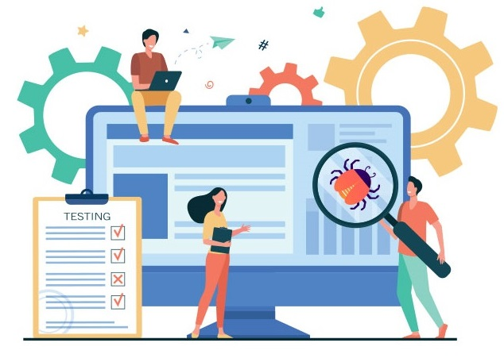

## 👋 About me 
Hola! Soy Marilina Scandalo. 
Desde el año 2022 me encuentro estudiando y practicando software testing. 
 
En este portfolio comparto mis conocimientos y practicas de QA que adquirí a través de diferentes cursos y también mediante el aprendizaje autodidacta.
 
Mi objetivo es continuar incorporando nuevas habilidades y herramientas para crecer profesionalmente como analista QA.

## ⚙️Tools 

	
	
	
	

<!--
**marilinasc/marilinasc** is a ✨ _special_ ✨ repository because its `README.md` (this file) appears on your GitHub profile.

Here are some ideas to get you started:

- 🔭 I’m currently working on ...
- 🌱 I’m currently learning ...
- 👯 I’m looking to collaborate on ...
- 🤔 I’m looking for help with ...
- 💬 Ask me about ...
- 📫 How to reach me: ...
- 😄 Pronouns: ...
- ⚡ Fun fact: ...
Icons: https://marwin1991.github.io/profile-technology-icons/
-->
